# UX Design Specification: Downloader

**Author:** fierce
**Date:** 2026-01-27

---

## Executive Summary

### Project Vision

Downloader is an information ingestion engine that transforms curated lists (URLs, DOIs, bibliographies) into organized, searchable, LLM-ready knowledge. The core promise is **"Trust that your knowledge is captured."**

**Brand Promise:** Capture. Organize. Trust.

**Interface Strategy:** CLI-first for MVP. GUI planned for v2 with "90s aesthetic."

### Target Users

| User Type | Profile | Current Pain |
|-----------|---------|--------------|
| Power Users / Data Hoarders | Download at scale, curate collections | Manual one-by-one downloads, lose track, organization never happens |
| Researchers | Build project-based knowledge bases | Fragmented workflow, LLM processing blocked by disorganized inputs |

**The "Aha" Moment:** User pastes 47 references, walks away, returns to find everything downloaded, organized, and indexed. "I'm never doing this manually again."

### Key Design Challenges

1. **Progress Communication** - How to show meaningful progress for batch operations (32/47 downloading, 3 queued, 2 failed) without overwhelming the terminal
2. **Error Presentation** - Failures shouldn't feel like failures; they're logged, actionable, non-blocking. UX must communicate "it's handled"
3. **Trust Building** - Zero-config start means users need immediate confidence the tool understood their input correctly
4. **Completion Summary** - The final output is the payoff moment. Must feel satisfying and complete.

### Design Opportunities

1. **Semantic Progress** - Not just counts, but meaningful status ("Resolving DOIs...", "Downloading from ScienceDirect...")
2. **Quiet Confidence** - Minimal output during success, detailed output only when needed
3. **"Walk Away" UX** - Design for users who won't watch the terminal. Completion summary is king.

## Core User Experience

### Defining Experience

**Core Loop:** Paste → Project → Walk Away → Return to Knowledge

The fundamental interaction is batch processing with minimal attention required. Users don't want to watch downloads—they want results.

### Platform Strategy

**Primary Platform:** CLI (Terminal)
- Keyboard-driven, no mouse required
- Pipe-friendly for scripting (`cat refs.txt | downloader --project "Research"`)
- Works over SSH for remote research workflows
- No GUI dependencies for MVP

**Input Methods:**
- stdin (piped input)
- Direct arguments
- File references (`--input refs.bib`)

### Effortless Interactions

| Interaction | Implementation |
|-------------|----------------|
| Input parsing | Auto-detect format (URL/DOI/reference/BibTeX) |
| Project setup | `--project "Name"` creates folder structure |
| Auth sites | Capture cookies from browser session |
| Failures | Log and continue, never block queue |

### Critical Success Moments

1. **Parsing Confirmation** - "Found 47 references (32 URLs, 12 DOIs, 3 references)"
2. **Progress Assurance** - Status line shows work is happening
3. **Completion Summary** - Clear success/failure counts with organized output

### Experience Principles

1. **Trust Over Transparency** - Communicate confidence, not implementation details
2. **Failures Are Data** - Logged for later action, never blocking
3. **Output Is The Product** - The organized folder matters, not the terminal output
4. **Quiet When Right, Clear When Wrong** - Minimal success noise, actionable failure info

### Input Feedback Pattern

Immediate parsing echo builds trust:
```
Parsed 47 items:
  32 URLs (direct)
  12 DOIs (will resolve)
   3 references (best-effort)
```

### Progress Design

- Spinners for active work (terminal should feel alive)
- In-place updates for counts (no scrolling spam)
- Status line: `[32/47] Downloading from sciencedirect.com...`

### Verbosity Levels

| Flag | Output |
|------|--------|
| (default) | Status line + completion summary |
| `--verbose` | Per-item progress |
| `--quiet` | Summary only (scriptable) |
| `--debug` | Full tracing |

### Completion Summary Design

```
✓ 44/47 downloaded successfully
✓ Organized to /Projects/Climate-Research/
✓ Index generated: index.md (12 topics)
⚠ 3 items need attention (see below)

  • sciencedirect.com/... → Run: downloader auth capture
  • example.com/paper.pdf → 404 Not Found
  • 10.1234/broken → DOI not found
```

### Interrupt & Recovery

- Ctrl+C gracefully stops, shows partial progress
- `downloader status` recalls last run summary
- Exit codes: 0 (success), 1 (partial), 2 (failure)

### Terminal Compatibility

- Detect terminal width, truncate gracefully
- Support `--no-color` and `NO_COLOR` env var
- Test in plain/dumb terminal mode

## CLI UX Patterns (Condensed)

### Error Message UX

**Structure:** Every error follows What → Why → Fix pattern.

```
Error: Authentication required for sciencedirect.com
       Your browser session may have expired.
       Fix: Run `downloader auth capture` to refresh credentials
```

**Error Categories & Tone:**

| Category | Icon | Tone | Example |
|----------|------|------|---------|
| Auth Required | 🔐 | Helpful | "Run `downloader auth capture`" |
| Not Found | ❌ | Factual | "404 - URL may have moved or been removed" |
| Network | 🌐 | Patient | "Connection timeout - will retry automatically" |
| Parse | ⚠️ | Informative | "Could not parse as DOI, treating as URL" |
| Rate Limited | ⏳ | Reassuring | "Rate limited by site - waiting 30s" |

**Error Grouping in Summary:**

```
⚠ 5 items need attention:

  Auth Required (2):
    • sciencedirect.com/article/123
    • nature.com/papers/456
    → Run: downloader auth capture

  Not Found (2):
    • example.com/removed.pdf
    • broken-link.org/paper
    → Verify URLs are still valid

  Parse Failed (1):
    • "Smith et al 2024" - insufficient metadata
    → Add DOI or direct URL
```

### CLI Command Structure UX

**Command Hierarchy:**

```
downloader                     # Default: read stdin, download to current dir
downloader download <input>    # Explicit download command
downloader project <cmd>       # Project management
downloader auth <cmd>          # Authentication management
downloader log <cmd>           # History and logging
downloader config <cmd>        # Configuration
```

**Flag Conventions:**

| Pattern | Example | Rationale |
|---------|---------|-----------|
| Short + Long | `-p, --project` | Muscle memory + discoverability |
| Verbs for actions | `--retry`, `--skip` | Clear intent |
| Nouns for targets | `--output`, `--input` | Clear destination |
| Booleans obvious | `--dry-run`, `--verbose` | No value needed |

**Help Text UX:**

```
downloader - Batch download and organize reference documents

USAGE:
    downloader [OPTIONS] [INPUT]
    cat refs.txt | downloader --project "Research"

EXAMPLES:
    downloader --project "Climate" urls.txt
    downloader --dry-run bibliography.bib
    echo "10.1234/paper" | downloader

OPTIONS:
    -p, --project <NAME>    Organize into project folder
    -o, --output <DIR>      Output directory [default: ./]
    -n, --dry-run           Preview without downloading
    -v, --verbose           Show per-item progress
    -q, --quiet             Summary only (for scripts)
    -h, --help              Show this help
```

### Output Formatting Guidelines

**Progress States:**

```
# Parsing (brief)
Parsing input... 47 items found

# Active download (single line, updates in place)
⠋ [12/47] Downloading from sciencedirect.com...

# Completion (expanded)
━━━━━━━━━━━━━━━━━━━━━━━━━━━━━━━━━━━━━━━━━━━━━━━━━
✓ Download Complete

  44 succeeded
   3 need attention (see above)

  Output: /Projects/Climate-Research/
  Index:  index.md (12 topics detected)
  Log:    download.log
━━━━━━━━━━━━━━━━━━━━━━━━━━━━━━━━━━━━━━━━━━━━━━━━━
```

**Color Usage:**

| Element | Color | Fallback |
|---------|-------|----------|
| Success | Green | ✓ prefix |
| Warning | Yellow | ⚠ prefix |
| Error | Red | ✗ prefix |
| Info | Cyan | • prefix |
| Muted | Gray | (parentheses) |

**Width Handling:**

```
# Wide terminal (>100 chars)
[12/47] Downloading: https://sciencedirect.com/science/article/pii/S0140...

# Narrow terminal (<80 chars)
[12/47] sciencedirect.com/.../S0140...

# Minimum (60 chars)
[12/47] Downloading...
```

### Emotional Response (CLI Context)

**Target Feelings by Phase:**

| Phase | User Should Feel | How We Achieve It |
|-------|------------------|-------------------|
| Input | "It understood me" | Immediate parsing feedback with counts |
| Progress | "It's working" | Alive spinner, site names, count updates |
| Waiting | "I can walk away" | No required interaction mid-process |
| Completion | "That was easy" | Clean summary, organized output |
| Errors | "I know what to do" | Actionable suggestions, grouped issues |

**Anti-Patterns to Avoid:**

- Wall of text during progress
- Cryptic error codes without explanation
- Requiring user input mid-batch
- Silent failures (always log, always report)
- Ambiguous success ("Done" without details)

## Implementation Notes

### indicatif Integration

```rust
// Progress bar style
let style = ProgressStyle::default_bar()
    .template("{spinner:.cyan} [{pos}/{len}] {msg}")
    .progress_chars("━━─");

// Multi-progress for verbose mode
let multi = MultiProgress::new();
```

### Color Support Check

```rust
// Respect NO_COLOR and --no-color
let use_color = !env::var("NO_COLOR").is_ok()
    && !args.no_color
    && atty::is(atty::Stream::Stdout);
```

### Terminal Width

```rust
// Graceful width detection
let width = terminal_size::terminal_size()
    .map(|(w, _)| w.0 as usize)
    .unwrap_or(80);
```

---

## Desired Emotional Response

### Primary Emotional Goals

The Downloader GUI should make users feel like **capable, independent owners of their knowledge** — not customers of a service. The tool works for them, not the other way around.

**Five emotional values, each anchored to a phase:**

| Value | Phase Anchor |
|---|---|
| **Empowered + in control** | Overview / Dashboard |
| **Focused + calm** | Overview / Dashboard |
| **Nostalgic** | Active downloads — ongoing rhythm |
| **Trust + Transparent** | Results, exploration, file output |
| **Delight** | General experience, small moments |

---

### Emotional Journey Mapping

| Phase | User Should Feel | Design Goal |
|---|---|---|
| **First open** | Immediate clarity — "I know exactly where to start" | Keyboard focus lands in input zone. No tutorial, no onboarding. The input zone IS the invitation. |
| **Input + Download trigger** | Capable, nostalgic, certain it will finish | Confident immediate feedback. Parsing echo before queue starts. Mode toggle visible. |
| **Active downloads** | Nostalgic, alive, rhythmic | Progress visible and honest. 90s-style status language. Dense, direct, functional. |
| **Something goes wrong** | Informed, not anxious | Errors surfaced without drama — "it handled it." Grouped, actionable, never blocking. |
| **Returning to completion** | Delightful, transparent, confident | The result is the payoff. Explorable, persistent, organised. |
| **Re-use / returning user** | Familiar ownership | Feels like *their* tool. History present. No account prompts, no upsells. |

---

### Three-View Structure

The app has three views, each with one job and one emotional register:

| View | Job | Emotion |
|---|---|---|
| `/input` | Invitation — give it your references | Immediate clarity, capable |
| `/run` | Progress — it's working for you | Nostalgic, confident it will finish |
| `/results` | Exploration — discover what you got | Delightful, transparent, trusting |

**Navigation flow:** `/input` → `/run` → `/results`

The transition from `/run` → `/results` is **intent-aware** based on a toggle set at `/input`.

---

### Intent-Aware Completion

Every run begins with an explicit mode choice on the `/input` view:

```
[ Watch results  ·  Walk away ]
```

| Mode | Behaviour | Emotional register |
|---|---|---|
| **Watch results** | Results stream into `/results` incrementally as each item completes | Capable, immediate, satisfying progress |
| **Walk away** | Run completes fully; clean summary waiting on return | Delightful discovery, confident trust |
| **Mode flip mid-run** | Graceful — no disruption, state preserved | Empowered, always in control |

The toggle generates real usage data. If behaviour consistently favours one mode, it becomes the default. If split, it stays explicit.

---

### Completion as Explorable Hub

Every run ends at a persistent, explorable **session card** — not a receipt, not a trophy. A clear end-point with the ability to explore what went there.

```
━━━━━━━━━━━━━━━━━━━━━━━━━━━━━━━━━━
  Climate Research  ·  Feb 25, 2026
  ✓ 44 downloaded   ⚠ 3 need attention
  📁 /Projects/Climate-Research/
  🏷 12 topics detected
━━━━━━━━━━━━━━━━━━━━━━━━━━━━━━━━━━
  [Explore results]  [View failures]  [Open folder]
```

- **Summary layer** — instant confidence: counts, path, topics
- **Exploration actions** — invitation to go deeper
- **Failures surfaced** — "need attention," not "errors" — actionable, not alarming
- **Persistent across sessions** — last run always available on next open (backed by existing SQLite history)

---

### Micro-Emotions

| Target | Avoid |
|---|---|
| Confidence | Confusion / fragility |
| Trust | Skepticism |
| Nostalgia | Sterile modernism |
| Delight | Dull adequacy |
| Independence | Corporate servitude |
| Accomplishment | Vague completion ("Done.") |

---

### Design Implications

| Emotion | UX Design Approach |
|---|---|
| **Empowered + in control** | Information-dense overview. All state visible. No hidden panels. |
| **Focused + calm** | Each view has one job. Tool stays out of the way during downloads. |
| **Nostalgic** | 90s UI vocabulary: real progress bars, status lines, dense grids, visible counts. Competent, not kitsch. |
| **Immediate clarity** | Input zone is the dominant element on first open. Keyboard focus lands there automatically. Three affordances (paste, drop, file picker), one target. |
| **Trust in results** | Transparent file listing. Honest counts (44/47, not just ✓). Output structure visible and explorable. |
| **Delight** | Small moments of craft — satisfying animations, thoughtful typography, the transition from `/run` → `/results`. |
| **Confident it will finish** | Progress communicates certainty. Activity always visible. No "stalled?" ambiguity. |
| **Anti-fragility** | Robust visual language. Tested under slow/failed downloads (fragility gate in story 10-2). |
| **Anti-corporate** | No cloud prompts. No upsells. No telemetry nags. Microcopy sounds like the tool trusts the user. |

---

### Microcopy as First-Class Design

Language in the UI is a design decision, not a dev afterthought:

| Element | Direction |
|---|---|
| Input zone placeholder | "Paste anything — URLs, DOIs, references, .bib files" — inviting, direct, non-clinical |
| Mode toggle | **"Watch results · Walk away"** — echoes the core UX language, emotionally resonant |
| Failures label | **"need attention"** not "errors" or "failed" — user stays in control |
| Exploration action | **"Explore results"** not "Browse files" — signals discovery, not file management |
| Return greeting | "Run complete while you were away — here's what happened" — warm, acknowledges the walk-away pattern |

---

### Emotional Design Principles

1. **Show, don't hide** — information density over minimalism; users always see what the tool is doing
2. **Craft signals trust** — small details communicate that this tool was made with care
3. **Nostalgia as competence language** — 90s UI vocabulary means *dense, direct, functional*; it respects the user's intelligence
4. **Completion is the reward** — the result screen is the emotional payoff and the entry point to exploration
5. **Independence, not service** — no platform dependency, no upsells; this tool is theirs
6. **One view, one job** — three views, three emotional registers, zero overlap

---

## UX Pattern Analysis & Inspiration

### Three-Tier Reference Architecture

| Tier | References | Purpose |
|---|---|---|
| **Aesthetic** | µTorrent, WinAmp, Obsidian | How it should look and feel |
| **Problem-space** | Mendeley, Elicit, SciSpace | Same user world — conventions to respect and improve on |
| **Download behaviour** | eMule, Kazaa, NetNewsWire/Reeder | Queue, progress, and history navigation patterns |

**One-sentence design target:**
> *µTorrent and WinAmp's spirit of dense, proud craft — executed with Obsidian's modern local-first sensibility — for users who already live in Mendeley and Elicit.*

---

### Inspiring Products Analysis

**µTorrent (classic, pre-bloat)** — *The gold standard for download density*
Tiny footprint, massive information density. Transfer table showed name / size / done / status / speed — all live. Global status bar. Right-click actions directly on queue items. Simple, light, innovative — purposefully small and purposefully capable. The definition of "proudly old": dense because it respects the user's intelligence, not because nobody cleaned it up.
→ *Primary reference for the `/run` view — take the principle of density, calibrated to Downloader's actual column count (not µTorrent's 12+).*

**WinAmp** — *Handmade proud aesthetic*
Dense interface in a small footprint — nothing wasted. Status bar always visible. Felt crafted by a human who cared, not assembled by a committee. The 90s aesthetic at its best: competent, direct, functional.
→ *Aesthetic register reference — small footprint, status bar, crafted feel.*

**Obsidian** — *Modern local-first execution*
The bridge between 90s spirit and 2026 execution. Local-first, file-system-native, keyboard-driven, zero cloud dependency. Command palette for power-user access. File explorer as first-class citizen. Dark mode by default with light mode supported via design tokens. Beloved by researchers and power users precisely because it is not corporate. Dense but navigable, modern but not sterile.
→ *The modern execution reference — how µTorrent/WinAmp spirit translates to 2026. Design tokens for both light and dark from story 10-1.*

**eMule / Kazaa** — *The honest download queue*
Dense, live queue table with all status visible simultaneously. Progress bars that felt real — bytes moving, speed fluctuating. Queue management kept the user always in control. Column-based information architecture for scanning many items at once.
→ *Download queue behaviour reference for `/run`.*

**Mendeley** — *The organised research library*
Library view with metadata columns (title, author, year, journal, tags). Left-panel collection hierarchy for project-based organisation. Inline exploration without leaving the app. Users who know Mendeley already have a mental model for what "organised reference collection" looks like — Downloader can speak this language in `/results` without reinventing it.
→ *Problem-space reference: `/results` library view conventions.*

**Elicit** — *The dominant input experience*
Single unambiguous input bar as the entry point. Immediate semantic feedback. Paper cards with key metadata surfaced without digging. Users already in this world understand the "paste and get results" pattern.
→ *Problem-space reference: `/input` dominant input zone and parsing echo conventions.*

**NetNewsWire / Reeder (RSS)** — *The three-pane content pattern*
Sources → list → content. Unread count visible. Read/unread state tells you what's new vs explored. History is first-class, not buried.
→ *History and content navigation reference for `/results` run history structure.*

---

### Transferable UX Patterns

**Navigation:**
- Three-pane layout (NetNewsWire) → projects → run history → file detail in `/results`
- Persistent last state (Mendeley, Obsidian) → last run always visible on open, history first-class
- Command palette (Obsidian) → keyboard-first power user access in Tauri

**Interaction:**
- Live column table (eMule, µTorrent) → `/run` view shows all items with live status columns, not a single spinner
- Right-click / context menu actions (µTorrent) → direct actions on individual items without navigating away
- Dominant input zone with immediate parsing echo (Elicit) → `/input` first-open moment
- Inline metadata surfacing (Mendeley, Elicit) → item cards show title, source, type without opening each item

**Visual:**
- Status bar always present (WinAmp, µTorrent) → global download state visible at all times during `/run`
- Small footprint, high density (µTorrent, WinAmp) → app window doesn't need to be large to be useful
- File explorer panel (Obsidian) → local files as first-class citizens in `/results`
- Design tokens for light + dark from day 1 (Obsidian) → both palettes defined in story 10-1, never retrofitted

---

### Anti-Patterns to Avoid

| Anti-pattern | Source | Why it conflicts |
|---|---|---|
| **Blank canvas setup burden** | Notion pattern | Downloader should be useful in 5 seconds, not after configuration |
| **Clunky accumulated complexity** | Zotero (negative side) | "Accidentally old" — menus on menus, discoverability low. Contrast: µTorrent is "proudly old" |
| **Background capture anxiety** | Zotero connector | "Is it running?" — Downloader is pull not push; user comes to it intentionally |
| **Cloud-first ownership language** | Dropbox, Google Drive | Files live *here*, not "up there" — conflicts with local-first identity |
| **Algorithm hides the library** | Spotify | Users can't see or trust what they own; opposite of transparency goal |
| **Ephemeral downloads** | Chrome download bar | Downloads disappear, no organisation, no exploration — the exact problem Downloader solves |
| **Team/cloud SaaS patterns** | Linear, Figma, Slack | Sign-in prompts, telemetry nags, team-first language |

---

### The "Proudly Old vs Accidentally Old" Test

Every dense or retro design choice must pass this test:

> *Is this dense because it respects the user's intelligence (µTorrent, WinAmp), or dense because nobody cleaned it up (Zotero's menus)?*

The former is the target. The latter is the trap.

---

### Design Inspiration Strategy

**Adopt directly (Epic 10 scope):**
- Live column table for `/run` (eMule + µTorrent) — density, honesty, real-time feedback
- Dominant input zone with immediate parsing echo (Elicit) — the `/input` first-open moment
- Library view with metadata columns (Mendeley) — the `/results` exploration view
- Status bar always visible (WinAmp + µTorrent) — global state never hidden
- Design tokens for both light/dark themes from story 10-2 (Obsidian) — never retrofit later
- Session card as explorable hub — summary + actions in `/results`

**Adapt for Downloader (Epic 10 scope):**
- Three-pane layout (NetNewsWire) → projects → history → file detail (not source → article → reading)
- µTorrent's right-click actions → Tauri context menus on individual downloaded items in `/results`
- Mendeley's metadata columns → adapted to Downloader's actual metadata (title, DOI, source domain, type, topics)

**Aspirational — post-Epic 10 (Obsidian spirit, not Epic 10 requirements):**
- Command palette / keyboard shortcut overlay
- Full file explorer panel
- Individual item detail / sidecar metadata view

**Explicitly avoid:**
- Any pattern requiring setup before the tool is useful (Notion)
- Accumulated visual complexity that was never designed (Zotero UI negatives)
- Cloud ownership framing in any copy, icon, or interaction (Dropbox, Drive)
- Hidden library / algorithm-curated experience (Spotify)
- Background process dependency model (Zotero connector)

---

### Highest-Value, Lowest-Cost Win

**The parsing echo is the single highest emotional-ROI interaction in the app.**

`parse_input()` already exists in `downloader_core` and returns counts by type. The frontend displays them immediately on paste — before any network call. ~20 lines of Tauri command + frontend code. Enormous trust-building impact for near-zero implementation cost. Must not be cut or deferred.

```
Paste anything — URLs, DOIs, references, .bib files
  ↓ immediate
Parsed 47 items: 32 URLs · 12 DOIs · 3 references
```

---

### Definition of Done Addition (all Epic 10 stories)

> Every story UI passes the **"proudly old / accidentally old" review** before merge:
> *Is this dense because it respects the user's intelligence, or dense because nobody cleaned it up?*

---

### Open Decisions (before story 10-3 scope is written)

| Decision | Options | Status |
|---|---|---|
| `/run` live table columns | name, source domain, type, status, progress — full list TBD | Deferred to story 10-3 planning |
| `/results` item detail | Inline expansion vs separate detail view | Deferred to story 10-3 planning |

---

## Design System Foundation

### Design System Choice

**Bare Svelte 5 + Vite + Tailwind CSS v3 + shadcn-svelte**

| Layer | Choice | Rationale |
|---|---|---|
| **Framework** | Svelte 5 (bare, no SvelteKit) | Compiles away — ~12KB runtime, nothing included that isn't used |
| **Routing** | Svelte store (~10 lines) | Three fixed views don't need a router library |
| **Styling** | Tailwind CSS v3 | Battle-tested with Tauri + Svelte, identical token strategy to v4 |
| **Component primitives** | shadcn-svelte (Bits UI) | Copy-paste owned components, accessible, no dependency lock-in |
| **Build tool** | Vite (Tauri default) | Zero extra configuration needed |

---

### Rationale for Selection

1. **Spirit match** — Svelte compiles away. The bundle is your app, nothing more. µTorrent/WinAmp philosophy in code form: small, purposeful, nothing wasted.
2. **Three views, no router needed** — fixed sequential navigation (`input → run → results`) handled by a single Svelte store. A full router would be included but unused.
3. **Tailwind v3 over v4** — identical design token strategy, more battle-tested with current Tauri + Svelte templates. Migrate to v4 when ecosystem catches up.
4. **shadcn-svelte** — produces Obsidian-style output by default. Copy-paste pattern means you own every component, no upstream breaking changes. Verify Svelte 5 runes compatibility for data table + input primitives before story 10-1 commits.
5. **No corporate fingerprint** — no Material, no Bootstrap, no Ant Design. The UI is what fierce designs.

---

### Project Structure

```
downloader-app/
├── src/
│   ├── lib/
│   │   ├── components/
│   │   │   ├── ui/         ← shadcn-svelte primitives (owned, copy-pasted)
│   │   │   └── app/        ← Downloader-specific compositions
│   │   ├── stores/
│   │   │   ├── view.ts     ← currentView: 'input' | 'run' | 'results'
│   │   │   └── downloads.ts ← download state from Tauri events
│   │   └── tokens.css      ← design tokens (light + dark)
│   ├── App.svelte           ← root: reads view store, renders correct view
│   ├── InputView.svelte     ← /input
│   ├── RunView.svelte       ← /run
│   └── ResultsView.svelte   ← /results
└── src-tauri/               ← Rust backend
```

---

### Design Token Strategy (story 10-1, never retrofitted)

```css
/* tokens.css */
:root {
  /* Spacing: 4px base — tighter than modern SaaS defaults */
  --spacing-1: 4px;
  --spacing-2: 8px;
  --spacing-3: 12px;
  --spacing-4: 16px;

  /* Border radius: 2px max — direct, not soft */
  --radius-sm: 1px;
  --radius-md: 2px;

  /* Typography */
  --font-mono: ui-monospace, SFMono-Regular, 'SF Mono', Cascadia Code, Consolas, monospace;
  --font-sans: system-ui, sans-serif;

  /* Colours (light — values finalised in step 8) */
  --color-bg:         #ffffff;
  --color-bg-muted:   #f5f5f5;
  --color-text:       #1a1a1a;
  --color-text-muted: #666666;
  --color-accent:     TBD;
  --color-success:    #22c55e;
  --color-warning:    #f59e0b;
  --color-error:      #ef4444;
}

.dark {
  --color-bg:         #0f0f0f;
  --color-bg-muted:   #1a1a1a;
  --color-text:       #e5e5e5;
  --color-text-muted: #888888;
  /* accent/success/warning/error adjusted for dark */
}
```

*Monospace font is system-default — zero load time, respects user's system, fits the tool aesthetic. JetBrains Mono as opt-in enhancement only.*

---

### Component Customisation Strategy

| Component | Base | Downloader customisation |
|---|---|---|
| Input / textarea | shadcn-svelte | Full-width, mono font, prominent border on focus |
| Data table | shadcn-svelte | Dense row height (32px), mono values, live-update capable |
| Badge / status | shadcn-svelte | Colour-coded by download status |
| Progress bar | shadcn-svelte | Thick (8px), real-feeling — not a thin modern stripe |
| Button | shadcn-svelte | Squared (2px radius), direct — no pill softness |
| Card | shadcn-svelte | Border, not shadow — session card in `/results` |

---

### Test Infrastructure (story 10-1, not deferred)

| Layer | Tool |
|---|---|
| Svelte components | Vitest + `@testing-library/svelte` v5 |
| Tauri IPC | `@tauri-apps/api/mocks` |
| Store logic | Vitest (pure functions) |
| E2E | `tauri-driver` + WebdriverIO (Linux/Windows CI) |

Scaffold in story 10-1 alongside the component system. Never deferred.

---

### Story 10-1 Prerequisites Checklist

- [ ] Verify shadcn-svelte Svelte 5 runes compatibility for: data table, input, badge, progress, button, card
- [ ] Confirm Tailwind v3 + Svelte 5 + Tauri template setup
- [ ] Define both light and dark token palettes (colours finalised in step 8)
- [ ] Scaffold Vitest + `@testing-library/svelte` v5
- [ ] Confirm `DOWNLOADER_REQUIRE_SOCKET_TESTS=1` in dev workflow (retro open item)

---

## Core User Experience (GUI)

### Defining Experience

**"Drop anything. It understands. Your collection grows."**

Two moments define the Downloader GUI — not one:

**Moment 1 — Instant understanding (the hook)**
The user drops a .bib file, pastes 47 mixed references, or types a DOI. Before anything downloads, the tool responds immediately:

```
Parsed 47 items:
  32 URLs  ·  12 DOIs  ·  3 references  ·  ⚠ 2 unrecognised (will try as URLs)
  [Watch results  ·  Walk away]   [Download]
```

Trust built in under 100ms for typical input. The tool demonstrated it understood exactly what it received — without questions, without configuration. Users feel *capable and understood* before clicking anything.

**Moment 2 — The collection (the payoff)**
The `/results` view is not the end of a download — it is the product. Users return (five minutes or five days later) to a collection that is *theirs*, growing across every run.

---

### Two-Tab Results View

`/results` resolves the run-centric vs collection-centric question without choosing sides:

```
━━━━━━━━━━━━━━━━━━━━━━━━━━━━━━━━━━━━━━━━
  [  This run  ]    [  Collection  ]
━━━━━━━━━━━━━━━━━━━━━━━━━━━━━━━━━━━━━━━━

  THIS RUN:                    COLLECTION:
  ─────────────────────        ──────────────────────
  Climate Research             📁 Climate Research (44)
  Feb 25 · 44 ✓ · 3 ⚠        📁 AI Papers        (12)
                               📁 Reading List      (8)
  [Explore results]
  [View failures]              Last updated: today
  [Open folder]
```

| Tab | Scope | Primary emotion |
|---|---|---|
| **This run** | Most recent completed session | Immediate, contextual — "what just happened" |
| **Collection** | All runs, organised by project | Accumulating value — "what I have now" |

**Default behaviour:** "This run" shown immediately after a download completes. Last-visited tab remembered on subsequent opens.

**Collection organisation (Epic 10):** By project — matches filesystem, matches `--project` flag, matches user mental model. Topic as secondary filter is post-Epic 10.

---

### User Mental Model

**How users currently solve this:**
- Download one file at a time, rename manually, lose track of organisation
- Use Zotero/Mendeley to manage references but download PDFs separately
- Paste URLs into browser tabs, save to Downloads folder, forget half of them

**What they bring to Downloader:**
- They understand "paste and submit" — every search engine taught them this
- They expect the tool to handle the mess — mixed formats, failed DOIs, paywalled papers
- They do NOT expect instant understanding — existing tools ask questions or fail silently
- They are surprised and delighted when parsing feedback appears before they click Download

**The mental model shift Downloader produces:**
Before: *"I download files and try to organise them later"*
After: *"I give Downloader my references and my collection grows"*

---

### Success Criteria

| Criterion | Signal |
|---|---|
| **Parsing echo appears in < 100ms (typical input < 200 items), non-blocking for all sizes** | User doesn't wonder "did it receive my input?" |
| User does not ask "what format should I use?" | Mixed input accepted without configuration |
| Unrecognised items surfaced, not silently dropped | Trust maintained even at the edges |
| User returns to `/results` without prompting | Completion is findable and inviting |
| User visits "Collection" tab on second open | Collection identity is established |
| User locates any file within 3 clicks | Collection is actually organised |
| User mentions the tool to a colleague | The word-of-mouth trigger |

---

### Novel vs Established Patterns

**Established:** paste-to-submit, progress indicators, file browser, tabs.

**Novel — needs to feel intuitive without explanation:**
- **Mixed-format acceptance** — URLs + DOIs + .bib + plain text in one paste. Make it feel *obvious in retrospect*.
- **Parsing echo as trust signal** — surfacing counts before the user clicks anything. Fast and accurate is the only requirement.
- **Unrecognised input handling** — shown in parsing echo, not silently dropped: `⚠ 2 unrecognised (will try as URLs)`
- **Intent-aware completion toggle** — "Watch results · Walk away" — labelled plainly, self-explanatory.

---

### Experience Mechanics

**Initiation:**
- App opens → keyboard focus in input zone, cursor blinking
- Label: "Paste anything — URLs, DOIs, references, .bib files"
- Three affordances: text input (default), drag-and-drop, file picker icon

**Interaction:**
- User pastes / drops / picks file
- Parsing echo appears < 100ms (typical) — counts by type, unrecognised items flagged
- User sets "Watch results / Walk away" toggle (optional)
- Presses Download or Enter → navigates to `/run`

**Feedback during run:**
- Live column table — each item a row, status columns updating in real time
- Status bar: global count, active domain, activity signal
- No "stalled?" ambiguity — always something visible

**Completion:**
- Transition to `/results` — streaming (watch mode) or summary (walk-away)
- "This run" tab shown: session card + three actions
- "Collection" tab available: all projects, updated totals

---

### Technical Decisions (Locked)

| Decision | Resolution |
|---|---|
| **Parsing echo strategy** | **Option 2a** — `tokio::spawn_blocking` wrapper around existing `parse_input()`. Single Tauri `emit()` event on completion. `parse_input()` itself unchanged. ~5 lines at call site. |
| Unrecognised input display | In parsing echo inline — `⚠ N unrecognised (will try as URLs)` |
| Two-tab `/results` | "This run" + "Collection" |
| Collection default sort | By project (Epic 10), topic filter post-Epic 10 |
| Default tab after run | "This run" — last visited tab remembered on subsequent opens |

---

## Visual Design Foundation

### Colour System

**Default theme: Warm Amber** — handcrafted, anti-corporate, proud ownership aesthetic.

```css
/* Theme: Warm Amber (default) */
.theme-amber {
  --color-bg:           #111008;
  --color-bg-surface:   #1c1a0f;
  --color-bg-elevated:  #252210;
  --color-border:       #2d2a1a;
  --color-border-focus: #d4a017;
  --color-text:         #e8e0c8;
  --color-text-muted:   #8a8070;
  --color-text-faint:   #5a5040;
  --color-accent:       #d4a017;
  --color-accent-hover: #e8b420;
  --color-success:      #7db87d;
  --color-warning:      #e07b39;
  --color-error:        #c0392b;
  --color-progress:     #d4a017;
}

/* Theme: Terminal Dark (µTorrent DNA) */
.theme-terminal {
  --color-bg:           #0d0d0d;
  --color-bg-surface:   #1a1a1a;
  --color-bg-elevated:  #222222;
  --color-border:       #2a2a2a;
  --color-border-focus: #00cc66;
  --color-text:         #e0e0e0;
  --color-text-muted:   #666666;
  --color-accent:       #00cc66;
  --color-success:      #00cc66;
  --color-warning:      #f5a623;
  --color-error:        #e74c3c;
  --color-progress:     #00cc66;
}

/* Theme: Obsidian Slate (researcher-familiar) */
.theme-obsidian {
  --color-bg:           #0f0f13;
  --color-bg-surface:   #1e1e2e;
  --color-bg-elevated:  #252535;
  --color-border:       #313244;
  --color-border-focus: #89b4fa;
  --color-text:         #cdd6f4;
  --color-text-muted:   #585b70;
  --color-accent:       #89b4fa;
  --color-success:      #a6e3a1;
  --color-warning:      #f9e2af;
  --color-error:        #f38ba8;
  --color-progress:     #89b4fa;
}

/* Theme: Zinc Minimal (clean canvas) */
.theme-zinc {
  --color-bg:           #09090b;
  --color-bg-surface:   #18181b;
  --color-bg-elevated:  #1e1e21;
  --color-border:       #27272a;
  --color-border-focus: #3b82f6;
  --color-text:         #fafafa;
  --color-text-muted:   #71717a;
  --color-accent:       #3b82f6;
  --color-success:      #22c55e;
  --color-warning:      #f59e0b;
  --color-error:        #ef4444;
  --color-progress:     #3b82f6;
}

/* Light: Warm Parchment (Amber light variant — default light) */
.theme-amber.light {
  --color-bg:           #faf7f0;
  --color-bg-surface:   #f0ead8;
  --color-bg-elevated:  #e8dfcc;
  --color-border:       #d4c9a8;
  --color-border-focus: #a07810;
  --color-text:         #1c180e;
  --color-text-muted:   #6b6048;
  --color-accent:       #a07810;
  --color-success:      #3a7a3a;
  --color-warning:      #b05a10;
  --color-error:        #9a2020;
  --color-progress:     #a07810;
}
```

**Status colour semantics (consistent across all themes):**

| Role | Meaning | Amber value |
|---|---|---|
| `--color-accent` | Active, interactive, brand | Gold `#d4a017` |
| `--color-success` | Downloaded successfully | Muted green |
| `--color-warning` | Needs attention, in progress | Burnt orange |
| `--color-error` | Failed, unrecoverable | Deep red |
| `--color-progress` | Active download bar fill | Matches accent |

**Theme order in picker:** Amber (default) → Terminal → Obsidian → Zinc

**Accessibility:** All text/background combinations target WCAG AA (4.5:1 minimum). Amber dark: `#e8e0c8` on `#111008` = 11.2:1. Status colours verified against surface, not background.

---

### Typography System

**Principle:** Monospace is a first-class citizen — data lives in mono, labels and navigation live in system-ui.

```css
--font-mono: ui-monospace, SFMono-Regular, 'SF Mono', Cascadia Code,
             Consolas, 'Courier New', monospace;
--font-sans: system-ui, -apple-system, BlinkMacSystemFont, 'Segoe UI',
             sans-serif;

/* Type scale — tighter than modern SaaS */
--text-xs:   11px;  /* status bar, metadata labels */
--text-sm:   12px;  /* table cells, secondary info */
--text-base: 13px;  /* primary UI text */
--text-md:   14px;  /* input field text */
--text-lg:   16px;  /* section headings */
--text-xl:   18px;  /* view titles */

/* Line heights */
--leading-tight:   1.2;  /* data tables */
--leading-normal:  1.4;  /* UI elements */
--leading-relaxed: 1.6;  /* readable prose */
```

**Usage map:**

| Element | Font | Size | Weight |
|---|---|---|---|
| View title | sans | 16px | 600 |
| Section labels | sans | 11px | 500, uppercase |
| Input placeholder | sans | 13px | 400 |
| Table header | sans | 11px | 600, uppercase |
| Table cell — filename | mono | 12px | 400 |
| Table cell — status | sans | 11px | 500 |
| Progress counts ("32/47") | mono | 12px | 600 |
| Status bar | mono | 11px | 400 |
| Parsing echo counts | mono | 13px | 600 |
| Error/warning messages | sans | 12px | 400 |

---

### Spacing & Layout Foundation

```css
/* Spacing scale — 4px base */
--space-1:  4px;
--space-2:  8px;
--space-3: 12px;
--space-4: 16px;
--space-5: 20px;
--space-6: 24px;
--space-8: 32px;

/* Component heights — dense */
--height-row:    32px;  /* data table row */
--height-input:  36px;  /* input field */
--height-button: 32px;  /* action buttons */
--height-status: 24px;  /* status bar */
--height-tab:    36px;  /* tab bar */

/* Border radius — direct, not soft */
--radius-sm:  1px;
--radius-md:  2px;
--radius-lg:  4px;  /* cards only */
```

**Layout principles:**

| Principle | Implementation |
|---|---|
| Information density first | 32px table rows, 12px data text — scan 15+ items without scrolling |
| Status bar always present | 24px fixed bar at bottom of `/run` — never hidden |
| Single-column input view | `/input` is full-width centred column — all attention on input zone |
| Minimal chrome | No sidebars in Epic 10. Three views = three full-screen layouts. |
| Border over shadow | `1px solid --color-border` for all cards and panels |

**Theme switching:** Stored via Tauri `store` plugin (persists across sessions). Four swatches in a settings popover — no dedicated settings screen for Epic 10.

---

### Accessibility Considerations

| Requirement | Approach |
|---|---|
| Contrast (text) | All themes WCAG AA minimum (4.5:1). Amber dark = 11.2:1. |
| Focus indicators | `--color-border-focus` visible ring on all interactive elements |
| Keyboard navigation | All three views fully keyboard-operable |
| Colour-blind safety | Status via icon prefix (✓ ⚠ ✗) in addition to colour |
| `NO_COLOR` / system pref | Degrades to zinc minimal |
| Font size minimum | 11px — acceptable for dense power-user tool |

---

## UX Design Status

**Scope:** CLI-focused MVP (GUI deferred to v2)

**Completed:**
- Executive Summary & Target Users
- Core User Experience & Principles
- Progress & Completion Design
- Error Message Patterns
- CLI Command Structure
- Output Formatting Guidelines
- Implementation Notes

**Deferred to v2 (GUI):**
- Visual Design System
- Component Strategy
- Responsive/Accessibility (beyond CLI)
- Design Directions & Mood Boards

**Document Status:** CLI UX Complete - Ready for Implementation

---

## Design Direction Decision

### Design Directions Explored

Three visual directions were generated and evaluated via interactive HTML showcase
(`_bmad-output/planning-artifacts/ux-design-directions.html`), each showing all three
views (/input, /run, /results) with full CSS token implementations:

| # | Direction | Accent | Bg | Personality |
|---|-----------|--------|----|-------------|
| 1 | **Warm Amber** | `#d4a017` gold | `#111008` deep charcoal | Scholarly, warm, lamplight on a desk |
| 2 | **Terminal Dark** | `#00cc66` green | `#0d0f0d` near-black | Hacker-nostalgic, focused, retro terminal |
| 3 | **Obsidian Slate** | `#89b4fa` blue | `#1e1e2e` grey-blue | Modern-calm, Catppuccin, clean |
| 4 | **Zinc Minimal** | `#3b82f6` blue | `#18181b` zinc-dark | Neutral utility, accessibility-first |

**Evaluation framework applied:** proudly-old test, emotional register on each view,
light/dark parity, scholarly trust signal, accent fatigue over long /run sessions.

**Hard eliminations:**

- **Terminal Dark as default**: fails the scholarly trust test ("capable but not hacky");
  `#00cc66` green triggers strong hacking/matrix associations inconsistent with academic
  positioning. Also fails light-mode parity — the accent has poor legibility on light
  backgrounds without a full redesign.
- **Zinc Minimal as default**: neutral utility, appropriate as accessibility option only.

---

### Chosen Direction

**Warm Amber** — brand identity direction. Ratified by fierce.

**Theme hierarchy for Epic 10:**

| Tier | Theme | Role | Status in Epic 10 |
|------|-------|------|-------------------|
| Identity | Warm Amber | Default, featured in docs/screenshots, brand face | Full visual QA each story |
| Productivity | Obsidian Slate | Deep-work mode, neutral alternative | CSS tokens present from 10-1; QA deferred |
| Enthusiast | Terminal Dark | Power-user skin, celebrated but secondary | CSS tokens present from 10-1; QA deferred |
| Accessibility | Zinc Minimal | Monochrome/corporate environments | CSS tokens present from 10-1; QA deferred |

Theme switcher: 4 swatches in settings popover (not a persistent toggle) — keeps Amber
as the de facto experience for users who never open settings.

---

### Design Rationale

**Why Warm Amber over Deferred or other directions:**

1. **"Proudly old" not "accidentally old"**: Gold on deep charcoal has a physical analogue —
   lamplight on a desk, a library at night, cream paper. It references *the act of scholarship*,
   not screen aesthetics. Terminal Dark references terminals; Obsidian references code editors.
   Amber references the user's domain.

2. **Emotional register on /run**: Amber accent (`#d4a017`) appears sparingly on the /run view —
   reserved for the active row indicator and the progress count (e.g., `44/47`). 95% of the
   view is `--text-primary` on `--surface-primary`. No accent fatigue. The gold acts as a
   *focus anchor*, not decoration. The status bar glows amber in "Watch" mode only — a quiet
   recording-indicator signal.

3. **Trust on /results**: Warm light is forgiving for a results view that shows both successes
   and failures. Green-on-black amplifies failure states; amber softens them without hiding them.

4. **WinAmp precedent**: The three-tier reference architecture identified WinAmp as an aesthetic
   reference. WinAmp shipped one skin *as the identity* (the original orange); others were
   available but the original remained the brand. Same model applied here: Amber is not just
   a preference — it *is* Downloader.

5. **Light-mode parity**: Warm Parchment (`#fdf6e3` bg, `#2c1810` text) is a strong design
   statement — cream paper, well-used notebook. Terminal Dark cannot achieve light-mode parity
   without a redesign. Amber commits to both modes from story 10-1.

---

### Implementation Approach

**Story 10-1 (foundation — must be locked before any UI):**

- Full Amber token set in CSS custom properties, both light + dark
- Warm Parchment light mode: `--bg: #fdf6e3`, `--text: #2c1810`, `--accent: #b8860b`
- Font stack with Windows fallback: `'Consolas', 'Courier New', Courier, monospace` for all
  data/values; system-ui sans for labels
- 4 theme CSS variable blocks present (Amber, Obsidian, Terminal, Zinc) — switchable from
  launch; Amber active by default
- `aria-live="polite"` on parsing echo zone; `aria-live="assertive"` on error states only
- Status bar: `aria-live="polite"` for mode changes, `aria-live="assertive"` for critical errors
- Vitest + @testing-library/svelte v5 scaffold included
- shadcn-svelte Svelte 5 runes compatibility confirmed before scaffold

**Story 10-2 (/input + download trigger — visual decisions locked here):**

- **Microcopy style guide (Amber scholarly voice)** pre-condition before story starts:
  - Facts + em-dashes, no ellipsis loading dots, no exclamation marks
  - Trusts the user to understand information without emotional scaffolding
  - Example: `12 items detected — 4 DOIs, 6 URLs, 2 unresolved` (not `Analysing 12 items...`)
- **Two-state /input view:**
  - *Empty state*: placeholder text + ghost example inputs in `--text-muted`
    - Ghost examples: `10.1038/nature12373` (CRISPR DOI, recognisable to researchers)
      and `https://arxiv.org/abs/2401.12345` — vanish on first keystroke/paste
  - *Active state*: parsing echo appears below textarea, placeholder hidden
- **"Watch results · Walk away" toggle**: flat pill (2px border-radius), physical slide feel;
  NOT a tab or text button pair. Mode echoed in status bar: `mode: watching` / `mode: batch`
  in `--text-muted` monospace. Pill filled with `--accent` gold in Watch mode.
- Parsing echo: fires from `tokio::spawn_blocking` via single Tauri event (Option 2a, locked
  in step 7). Rendered in Amber scholarly copy format.

**Story 10-3 (/run + /results — table and collection):**

- **Live /run table column structure:**
  ```
  [type icon 20px] · title/doi (40ch truncated) · source domain · status
  ```
  Size column deferred to hover state and /results card (not in live table).
  Type icon: PDF 📄, HTML 🌐, unknown ❓ — 20px, `--text-muted`.
- **Two-tab /results view:**
  - "This run" tab: active by default after download, session card with actions
  - "Collection" tab: accumulates all runs by project
  - Default tab on first launch: "This run"; remembers last tab on subsequent opens
- **Empty "Collection" tab copy** (Amber scholarly voice, monospace, centred, `--text-muted`):
  ```
  your collection starts here.
  every run adds to it.
  ```
  No button, no CTA, no onboarding wizard. Two lines. Statement of fact.

**Deferred post-Epic 10:**
- Visual QA pass on Obsidian/Terminal/Zinc themes
- History hints in /input empty state (last 3 inputs as ghost examples)
- Topic filter in Collection tab
- /results item detail expansion (inline vs detail view TBD)
- `tauri-driver` macOS E2E (pending macOS WebDriver support)


---

## User Journey Flows

Six critical journeys cover the complete Epic 10 GUI experience. Epic 10 is four stories:
**10-1** (scaffold) · **10-2a** (core /input) · **10-2b** (extended /input) · **10-3** (/run + /results).

---

### Journey 1: First-Download (Core Loop)

The primary journey. A researcher has a list of DOIs or URLs and opens the app.

```mermaid
flowchart TD
    A([App opens]) --> B{Incomplete queue\nin SQLite?}
    B -->|Yes| C[Resume banner above textarea\nnon-blocking inline\nPrevious run incomplete — N remaining  Resume  Dismiss]
    B -->|No| D[/input — empty state\nGhost examples visible]
    C -->|Resume| E[Journey 5]
    C -->|Dismiss| D
    D --> F{User action}
    F -->|Paste or type| G[Textarea receives input\nGhost examples vanish]
    G --> H[Parsing echo fires async\ntokio::spawn_blocking → Tauri event]
    H --> I["12 items detected — 4 DOIs, 6 URLs,\n2 unresolved, 1 already in collection\n(--text-muted, monospace, below textarea)"]
    I --> J{Zero items detected?}
    J -->|Yes| K[Download button disabled\ndownload in progress text or no items message]
    J -->|No| L{User reviews echo}
    L -->|Edits input| G
    L -->|Sets project name| M[Project name field\noptional — saving to path updates live]
    M --> N{Toggle Preview?}
    L --> N
    N -->|Preview on| O[Preview mode — no files downloaded\nbutton reads Preview]
    N -->|Preview off / default| P[Set mode toggle]
    O --> P
    P -->|Watch results| Q[Mode: watching — status bar echo]
    P -->|Walk away| R[Mode: batch — status bar echo]
    Q --> S[Download / Preview button\nCmd+Enter]
    R --> S
    S --> T[Run active — button replaced with\ndisabled download in progress text]
    T --> U[Transition to /run view]
    U --> V[Live table populates\ntype icon · title/doi · source · status]
    V --> W{Mode?}
    W -->|Watch| X[Results stream to /results\nas each download completes]
    W -->|Walk away| Y[User may close window\nDownloads continue in background\ndock badge on completion]
    X --> Z[All rows reach terminal state]
    Y --> Z
    Z --> AA{Walk away?}
    AA -->|Watch| AB[Auto-transition to /results — This run tab]
    AA -->|Walk away| AC[Status bar shifts to --accent gold\nview results → CTA appears\nmacOS notification fires]
    AC --> AB
    AB --> AD[Session card + item list]
    AD --> AE{User action}
    AE -->|Explore items| AF[Item actions: Open file\nReveal in Finder · Copy DOI · Copy citation]
    AE -->|Session actions| AG[Open project folder\nCopy all DOIs · Export BibTeX]
    AE -->|Start another run| AH[Navigate to /input\nCmd+1]
    AE -->|View Collection| AI[Switch to Collection tab\nCmd+right-bracket]
```

**Key decisions locked:**
- Parse fires async (`tokio::spawn_blocking`); single Tauri event on completion — never blocks UI
- Project name optional; blank → metadata inference fallback (CLI Epic 5 behaviour)
- `saving to:` path updates live as project name is typed
- Download button replaced with `[download in progress]` text (not greyed) while run is active — no concurrent runs in Epic 10
- Walk-away completion: dock badge + status bar `--accent` gold shift + `view results →` CTA + macOS notification
- macOS notification content (Amber voice): `[project name] complete` / `44 of 47 downloaded · 3 failed` / `[View results]` action button — no exclamation mark, no emoji

---

### Journey 2: Return User — Collection Exploration

User has prior download history. Opens app to explore or start a related run.

```mermaid
flowchart TD
    A([App opens]) --> B{Has prior history?}
    B -->|No| C[/input empty state\nGhost examples]
    B -->|Yes| D[/input empty state\nReady for new input]
    D --> E{User intent}
    E -->|New download| F[Journey 1]
    E -->|Explore history| G[Navigate to /results — Cmd+2]
    G --> H{Last tab remembered?}
    H -->|This run| I[This run tab — last session]
    H -->|Collection| J[Collection tab]
    I --> K[User switches to Collection\nCmd+right-bracket]
    K --> J
    J --> L{Collection populated?}
    L -->|Empty| M["your collection starts here.\nevery run adds to it.\n(monospace, centred, --text-muted)"]
    L -->|Has runs| N[Runs listed by project\nmost recent first]
    N --> O{User action}
    O -->|Selects a run| P[Run detail: items, statuses,\nfile paths, session card]
    O -->|Item actions| Q[Open file · Reveal in Finder\nCopy DOI · Copy citation]
    O -->|Session actions| R[Open project folder\nCopy all DOIs · Export BibTeX]
    O -->|Start related run| S[Copy DOI/URL from item\nNavigate to /input — Cmd+1\nPaste and begin Journey 1]
    P --> Q
```

**Deferred post-Epic 10:** Collection search/filter (trigger: >10 runs in any project); topic filter.

---

### Journey 3: Authentication Required

User pastes publisher URLs requiring institutional access.

```mermaid
flowchart TD
    A[/input — paste includes auth-gated URLs] --> B[Parsing echo detects them\n8 items detected — 3 URLs 5 DOIs]
    B --> C[Download]
    C --> D[/run — downloads begin]
    D --> E{Row hits auth wall}
    E -->|status: auth required| F[Inline What/Why/Fix notification\nno modal]
    F --> G["What: Download blocked\nWhy: Publisher requires login\nFix: Provide cookies for sciencedirect.com"]
    G --> H{User action}
    H -->|Provide cookie file| I[Tauri file dialog\ncookie file picker]
    H -->|Capture from browser| J[Browser dropdown\nChrome · Firefox · Safari]
    H -->|Skip this item| K[status: skipped\ncontinues with rest]
    I --> L[Cookies stored securely\nEpic 4 storage layer — unchanged]
    J --> M[User selects browser\nRust calls existing capture_browser_cookies\nbrowser: BrowserType — Epic 4 unchanged]
    M --> L
    L --> N[Auth-required rows retry automatically]
    N --> O{Retry result}
    O -->|Success| P[status: complete ✓]
    O -->|Still blocked| Q[status: failed\nerror detail available]
    P --> R[Continue /run]
    Q --> R
    K --> R
```

**Implementation note:** Browser cookie capture UI is a dropdown that passes browser name to the existing `capture_browser_cookies(browser: BrowserType)` function (Epic 4, unchanged). Minimal new code — Tauri dropdown → existing Rust function.

---

### Journey 4: Error Recovery — Partial Failures

Some downloads fail. User understands what happened and decides next action.

```mermaid
flowchart TD
    A[/run — all rows reach terminal state] --> B[Transition to /results — This run tab]
    B --> C["Session card:\n44 of 47 complete — 3 failed"]
    C --> D{User examines failures}
    D --> E[Failed items in run list\nstatus + typed reason]
    E --> F{Failure reason}
    F -->|auth required| G[Journey 3]
    F -->|404 not found| H[status: not found\nsource: domain]
    F -->|network timeout| I["status: timed out\nafter N retries (Epic 6 retry logic)"]
    F -->|unresolved reference| J[status: unresolved\ncould not identify input]
    F -->|skipped — already complete| K[status: skipped\nfile exists and matches checksum]
    H --> L{User action}
    I --> L
    J --> L
    L -->|Copy item identifier| M[Navigate to /input\nPaste with modified source\nJourney 1 retry]
    L -->|Accept partial success| N[44 of 47 is a valid outcome\nCollection updated with all attempts]
    K --> N
    M --> O[Journey 1]
    G --> P[Retry resolves or confirms failure]
    P --> N
```

**Terminal states** (four, exhaustive):
`complete ✓` · `failed` (with typed reason) · `skipped — already complete` · `unresolved`

No item is left in an ambiguous state at run end. Partial success (44/47) is shown as the positive count first, failures second — not as "3 failures."

**Unresolved items in /run table:** Items the parser could not identify enter the table with `status: unresolved`. They are not silently dropped. Parsing echo reports the count; /run shows the detail. Consistent with terminal-state clarity pattern.

**File conflict handling:** If a file already exists and checksum matches (Epic 3 resumable downloads), status is `skipped — already complete`. Parsing echo surfaces: `1 already in collection`. Not a failure — greyed, not red.

---

### Journey 5: Resume Interrupted Run

App was closed or crashed during a Walk-away run. On next launch, SQLite queue has incomplete items.

```mermaid
flowchart TD
    A([App launches]) --> B[Check SQLite queue\nfor incomplete items]
    B -->|Incomplete items found| C[Resume banner above textarea\nnon-blocking — does not block input]
    C --> D["Previous run incomplete — 3 of 47 remaining\n[Resume]  [Dismiss]"]
    D -->|Resume| E[Transition to /run\npick up from last completed item]
    D -->|Dismiss| F[Banner gone\nnormal /input state]
    E --> G[/run — continues from item N+1\nalready-complete items shown as complete ✓]
    G --> H[Journey 1 from run completion]
    B -->|Queue clean| I[Normal /input empty state]
```

**Backend note:** Resume logic is fully implemented in Epic 3 (`3-6-resumable-downloads`). GUI surfaces it via a non-blocking banner — no new Rust code required.

---

### Journey 6: Settings / Configuration

User configures output folder, theme, default mode, and optional developer options.

```mermaid
flowchart TD
    A{Entry point} --> B[Settings popover\ntriggered by theme icon\nor saving to change link]
    B --> C[Settings popover contents]
    C --> D[Output folder path\nReveal in Finder button]
    C --> E[Theme swatches\nAmber · Obsidian · Terminal · Zinc]
    C --> F[Default mode\nWatch results · Walk away]
    C --> G[Preview mode toggle\ndry run — no files downloaded]
    C --> H[Developer logs toggle\nverbose output — deferred Epic 10]
    D --> I{User action}
    E --> I
    F --> I
    G --> I
    I -->|Changes value| J[write_config AppConfig\nTauri command → config.toml]
    J --> K[saving to path updates in /input\nTheme applies immediately\nDefault mode applied to next run]
    I -->|Closes popover| L[Return to previous view]
```



**Tauri IPC (2 commands, scaffolded in story 10-1):**
- `read_config() → AppConfig` — called on launch
- `write_config(config: AppConfig)` — called on any settings change

**Settings popover layout:**
```
Output folder: ~/Downloads/Downloader        [Reveal in Finder]
Theme:         ○ Amber  ○ Obsidian  ○ Terminal  ○ Zinc
Default mode:  ○ Watch results  ● Walk away
Preview mode:  [toggle]
```

Config persists to `~/.config/downloader/config.toml` (Epic 7 config layer — unchanged).

---

### Journey Patterns

Three reusable patterns across all six journeys:

**1. Echo-before-commit**
The async parsing echo fires as soon as input is present, before any destructive action. User always sees what the system understood before committing. Surfaces: item counts, typed categories (DOIs/URLs/unresolved), duplicates (`N already in collection`). Applied in: Journeys 1, 3, 4.

**2. What/Why/Fix (inherited from Epic 7)**
Every blocked state surfaces three things: what stopped, why it stopped, what the user can do. No bare error codes. GUI adopts the same vocabulary as the CLI — same pattern, new visual surface. Applied in: Journeys 3, 4.

**3. Terminal-state clarity**
Every item reaches one of four terminal states: `complete ✓` / `failed [typed reason]` / `skipped — already complete` / `unresolved`. No item is left ambiguous at run end. The session card reflects only terminal states. Applied in all journeys.

---

### Keyboard Navigation

Minimum keyboard bindings — must be specified in story scope or they will not ship:

| Action | Key | Story |
|--------|-----|-------|
| Submit download / preview | `Cmd+Enter` | 10-2a |
| Navigate to /input | `Cmd+1` | 10-2a |
| Navigate to /run | `Cmd+3` | 10-2a |
| Navigate to /results | `Cmd+2` | 10-2a |
| Escape (no-op if run active) | `Escape` | 10-2a |
| Switch /results tab forward | `Cmd+]` | 10-3 |
| Switch /results tab backward | `Cmd+[` | 10-3 |

Keyboard handler module scaffolded in story 10-1 (empty pattern); individual bindings registered in the story that ships the corresponding view. `Escape` guard: no navigation away from /run while a run is active.

---

### Flow Optimisation Principles

| Principle | Application |
|-----------|-------------|
| **No mandatory modals** | Auth, errors, settings, and confirmations are inline — never block the rest of the run |
| **One decision per view** | /input: what + mode + project name. /run: watch or walk away. /results: act or start again |
| **Partial success is success** | `44/47` shown as positive count first; failures secondary — not "3 failures" |
| **Same vocabulary CLI→GUI** | Error types, retry logic, status names match Epic 6/7 CLI — reduces learning curve for CLI users upgrading |
| **Async by default** | Parsing echo, download engine, config reads, collection updates all non-blocking — no spinner before next view |
| **Concurrent runs deferred** | One run at a time in Epic 10; Download button replaced with `[download in progress]` text while active |
| **Actions close the loop** | /results item and session actions (Open, Reveal, Copy DOI, Export BibTeX) are the tool's exit into the researcher's workflow |

---

### Epic 10 Story Scope Allocation

| Story | Journeys covered | Key journey elements |
|-------|-----------------|---------------------|
| 10-1 (scaffold) | 6 (config IPC) | `read_config()` / `write_config()` Tauri commands; Amber token set; keyboard handler module; aria-live zones; Vitest scaffold |
| 10-2a (core /input) | 1 (core path), 5 (resume banner) | Textarea + parsing echo + mode toggle + download trigger; resume banner; Cmd+Enter; Cmd+1/2/3; Escape guard |
| 10-2b (extended /input) | 1 (project name, preview), 6 (settings) | Project name field; Preview mode; settings popover; zero-result disabled state; file conflict in echo |
| 10-3 (/run + /results) | 1 (run + results), 2 (collection), 3 (auth UI), 4 (failures) | Live table; Walk-away return (dock badge, notification, status bar); two-tab /results; item + session actions; browser cookie dropdown |

---

## Component Strategy

### Design System Components

**Stack:** Bare Svelte 5 + Vite + Tailwind CSS v3 + shadcn-svelte (Bits UI).
All components are copy-paste owned — no runtime library dependency, fully editable, fully testable.

**Available from shadcn-svelte (restyled with Amber tokens):**

| Component | Used in |
|-----------|---------|
| `Button` | /input download trigger, /results action buttons |
| `Input` | Project name field, output folder display in settings |
| `Textarea` | Main /input paste area |
| `Popover` | Settings popover container |
| `Tabs` | /results "This run" \| "Collection" tab bar |
| `Switch` | Preview mode toggle, developer logs toggle in settings |
| `Separator` | View boundary dividers |
| `Badge` | Status display in /run table rows |

---

### Custom Components

Thirteen custom components (twelve original + `AuthPrompt` added from party review).
All use CSS custom properties from the Amber token set; theme switching via `data-theme` on `<html>`.

#### `ParseEcho`

**Purpose:** Display async parse result below the textarea. Listens for `parse-complete` Tauri event; renders structured count line in Amber scholarly voice.

**Anatomy:**
```
12 items detected — 4 DOIs, 6 URLs, 2 unresolved, 1 already in collection
```

**States:** `idle` (hidden) · `complete` (count line visible) · `zero` (triggers DownloadButton disabled)

**Style:** `--text-muted`, `--font-mono`, 12px, `aria-live="polite"`

**Content rules (Amber voice):** em-dashes not ellipsis, no loading dots, no exclamation marks, states facts

**Tauri binding (critical — listener lifecycle must be explicit):**
```svelte
$effect(() => {
  let unlisten: (() => void) | null = null
  ;(async () => {
    unlisten = await listen('parse-complete', (event) => {
      counts = event.payload
    })
  })()
  return () => unlisten?.() // cleanup on destroy — prevents listener leak
})
```
**Test priority: CRITICAL** — `ParseEcho` listener destroy test must be written first (red-green-refactor). Duplicate listener on re-mount is a silent production bug.

---

#### `ModeToggle`

**Purpose:** Binary run-mode selector. "Watch results" = stream to /results during run. "Walk away" = batch summary on return.

**Anatomy:** Flat pill container (2px border-radius), two labels, filled segment slides between them.

**States:** `watch` (left filled, `--accent` gold) · `walk-away` (right filled)

**Status bar echo:** updates on toggle — `mode: watching` / `mode: batch`

**ARIA:** `role="group"`, each option `role="radio"`, `aria-checked`

**Keyboard:** `Space`/`Enter` toggles when focused; `Tab` focusable

---

#### `DownloadButton`

**Purpose:** Primary CTA that morphs based on `$runState.phase`. Never appears broken — always communicates state.

**States:**
- `idle` (phase: idle) — `[Download]` — `--accent` border, `--text-primary`
- `preview` (Preview mode on) — label reads `[Preview]`
- `active` (phase: active) — replaced with plain text `download in progress`, `--text-muted`, `--font-mono`, not a button element
- `disabled-zero` — button rendered but `disabled`, reason communicated via ParseEcho zero state

**Keyboard:** `Cmd+Enter` fires from anywhere in /input (keyboard handler module — not button-scoped)

---

#### `ResumeBanner`

**Purpose:** Inline non-blocking notification on launch when incomplete queue detected. Appears above textarea; does not block input.

**Anatomy:**
```
Previous run incomplete — 3 of 47 remaining        [Resume]  [Dismiss]
```

**States:** `visible` · `hidden`

**Style:** `--surface-secondary` bg, `--border` 1px bottom, full width, 36px height, `--font-mono`, `--text-muted`

**ARIA:** `role="status"`, `aria-live="polite"` — announced once on mount

---

#### `SaveToPath`

**Purpose:** Passive output-folder confirmation below DownloadButton. Reactive to project name input and `$config` store.

**Anatomy:**
```
saving to: ~/Downloads/Downloader/climate-paper    ⟶ change
```

**Behaviour:** Path is a Svelte 5 derived value: `$config.outputFolder + '/' + ($projectName || inferredName)`. `⟶ change` opens settings popover to folder section.

**Style:** `--text-muted`, `--font-mono`, 11px — a quiet confirmation, not a feature

---

#### `RunTable`

**Purpose:** Live streaming table on /run view. Rows populate as downloads start; status updates in place.

**Columns:** `[TypeIcon 20px]` · `title/doi (40ch truncated)` · `source domain` · `status`

**Row height:** 32px (4px base × 8)

**Row states:**
- `initializing` — placeholder row `starting...` in `--text-muted` before first event arrives
- `queued` — dim, `--text-muted`
- `downloading` — normal weight, animated status indicator
- `complete ✓` — `--text-muted` (de-emphasised after completion)
- `failed` — typed reason displayed, `--text-primary`
- `skipped — already complete` — `--text-muted`, italic
- `unresolved` — `--text-muted`, italic
- `auth required` — highlighted; renders `AuthPrompt` inline below row

**State management (critical):** `$runState.items` is replaced on each Tauri event (not mutated):
```typescript
// correct — triggers Svelte 5 reactivity
runState.items = [...runState.items, newItem]
// incorrect — push() is not tracked by $state
runState.items.push(newItem)
```

**ARIA:** `role="log"`, `aria-live="polite"` — rows announced as they arrive

**Size column:** deferred to hover tooltip and /results session card — not in live table

---

#### `StatusBar`

**Purpose:** Fixed bottom bar across /run and /results. Monospace. Communicates mode, counts, and run-completion signal.

**Anatomy:**
```
mode: watching    44/47 complete    2 failed    2 min 14 sec
```

**Colour states (via CSS class toggle — not animation):**
- Default: all `--text-muted`
- Run active, Watch mode: `mode: watching` text in `--accent` gold — the recording indicator
- Run complete, Walk-away (`.run-complete` class applied): entire bar `--accent` gold; `view results →` CTA right-aligned
- Error present: failure count in `--text-error` or reduced-opacity amber

**Props:** `runComplete: boolean` — when true, `.run-complete` class added to bar element. No transition library needed.

**Height:** 24px (4px base × 6)

**ARIA:** `role="status"`, `aria-live="polite"` for mode changes; `aria-live="assertive"` for critical errors only

**`NotificationPayload` ownership:** Walk-away completion notification lives in `App.svelte`, not `StatusBar`:
```svelte
$effect(() => {
  if ($runState.phase === 'complete' && $runState.mode === 'walk-away') {
    sendNotification({
      title: `${$runState.projectName} complete`,
      body: `${completeCount} of ${total} downloaded · ${failCount} failed`,
      actions: [{ id: 'view', title: 'View results' }]
    })
  }
})
```
Notification content follows Amber voice: no exclamation mark, no emoji, states facts.

---

#### `TypeIcon`

**Purpose:** 20px inline icon identifying item type in /run table and /results list.

**States:** `pdf` → PDF icon · `html` → HTML icon · `unknown` → unknown icon

**Style:** `--text-muted`, vertically centred in 32px row, 20px fixed width

**ARIA:** `aria-label="PDF"` / `aria-label="HTML"` / `aria-label="Unknown type"`

---

#### `SessionCard`

**Purpose:** Compound component at top of /results "This run" tab. Summarises completed run; provides session-level actions.

**Anatomy:**
```
climate-paper          44 of 47 complete · 2 min 34 sec · 2 failed
[Open project folder]  [Copy all DOIs]  [Export BibTeX]
```

**States:** `success` · `partial` (failure count highlighted) · `preview` ("Preview — no files downloaded") · `empty` (`no run yet. / start from /input.` — monospace, centred, muted)

**Actions:**
- `Open project folder` → `open_path(folderPath)` Tauri command
- `Copy all DOIs` → clipboard API
- `Export BibTeX` → Tauri save dialog + BibTeX generation (Epic 8 `8-6-bibtex-format-support` backend — unchanged)

---

#### `ItemRow`

**Purpose:** Single item in /results list. Shows title, source, status. Reveals actions on hover.

**Default anatomy:**
```
[TypeIcon]  Title/DOI (40ch)                              ✓ complete
            10.1038/nature12373 · domain · 2.4 MB
```

**Hover anatomy:**
```
[TypeIcon]  Title/DOI (40ch)                              ✓ complete
            10.1038/nature12373 · domain · 2.4 MB
            [Open file]  [Reveal in Finder]  [Copy DOI]  [Copy citation]
```

**Actions:**
- `Open file` → `open_path(filePath)`
- `Reveal in Finder` → `open_path(folderPath)`
- `Copy DOI` → clipboard
- `Copy citation` → formatted string from JSON-LD sidecar (Epic 8 `8-2-json-ld-sidecar-files`)

**States:** `complete` · `failed` · `skipped` · `unresolved` — background and status colour vary per state

**Keyboard:** `Enter` on focused row opens file; `Tab` cycles through hover actions when row focused

**Metadata source:** JSON-LD sidecar — title, journal, DOI, file size

---

#### `ThemeSwatch`

**Purpose:** Visual radio group for theme selection in settings popover.

**Anatomy:** 4 × 24px circular swatches — Amber gold, Obsidian blue, Terminal green, Zinc neutral. Selected swatch has 2px `--accent` ring.

**ARIA:** `role="radiogroup"`, each swatch `role="radio"`, `aria-label="Warm Amber"` etc.

**On selection:** calls `write_config()` with updated theme; `data-theme` attribute on `<html>` updates immediately

---

#### `AuthPrompt`

**Purpose:** Inline What/Why/Fix notification rendered below an `auth required` row in `RunTable`. Provides cookie input affordances without a modal.

**Anatomy:**
```
What:  Download blocked
Why:   Publisher requires login — sciencedirect.com
Fix:   Provide cookies to proceed

[Provide cookie file...]    [Capture from browser ▼]
                                ├── Chrome
                                ├── Firefox
                                └── Safari
[Skip this item]
```

**States:** `visible` (auth required, awaiting user action) · `retrying` (cookies provided, download retrying) · `resolved` (row transitions to `complete` or `failed`, prompt dismissed)

**IPC commands (scaffolded in 10-1, implemented in 10-3):**
- `provide_cookie_file(domain: String, path: String)` → delegates to Epic 4 Rust storage
- `capture_browser_cookies(domain: String, browser: String)` → delegates to Epic 4 `capture_browser_cookies(BrowserType)` — unchanged

**ARIA:** `role="region"`, `aria-label="Authentication required"`, `aria-live="polite"` for status updates

---

### Component Implementation Strategy

**Ownership model:** All components in `src/components/` as `.svelte` files — copy-paste owned, no version lock-in, fully editable and testable.

**Token inheritance:** Every component uses CSS custom properties. No hardcoded colours or sizes. Theme switching via single `data-theme` attribute on `<html>`.

**Global state (three stores, Svelte 5 writable):**

```typescript
// $view — current view
type View = 'input' | 'run' | 'results'

// $runState — active run
type RunState = {
  phase: 'idle' | 'active' | 'complete' | 'preview'
  items: RunItem[]
  projectName: string
  startedAt: number | null
  completedAt: number | null
  mode: 'watch' | 'walk-away'
}

// $config — user configuration (blocking load on startup)
type AppConfig = {
  outputFolder: string
  theme: 'amber' | 'obsidian' | 'terminal' | 'zinc'
  defaultMode: 'watch' | 'walk-away'
  previewMode: boolean
}
```

`$runState.phase` is the single source of truth driving: `DownloadButton` morphing, `StatusBar` colour shift, `Escape` guard, Walk-away notification trigger.

`$config` loaded in `App.svelte` `onMount` **before child components render** — prevents `SaveToPath` null-path flash.

**Tauri IPC surface (all commands):**

| Command | Story | Notes |
|---------|-------|-------|
| `read_config() → AppConfig` | 10-1 | Blocking on startup |
| `write_config(config: AppConfig)` | 10-1 | On any settings change |
| `open_path(path: String)` | 10-1 | Shared: Open file, Reveal, Folder |
| `provide_cookie_file(domain, path)` | 10-3 | Epic 4 Rust — unchanged |
| `capture_browser_cookies(domain, browser)` | 10-3 | Epic 4 Rust — unchanged |

Tauri events listened (frontend):
- `parse-complete` → `ParseEcho` (with explicit unlisten cleanup)
- `download-progress` → `RunTable` row status updates
- `run-complete` → `$runState.phase = 'complete'`

**Testing approach:**

| Component | Test complexity | Key test cases |
|-----------|----------------|----------------|
| `ParseEcho` | **Critical** | Listener lifecycle (unlisten on destroy); count string format; zero → button disabled |
| `RunTable` | High | Row append on event; all 5 terminal state renders; initializing placeholder |
| `StatusBar` | Medium | `.run-complete` class on completion; aria-live fires; mode echo text |
| `AuthPrompt` | Medium | Renders on auth-required row; IPC called on cookie file + browser selection; dismissed on resolve |
| `DownloadButton` | Medium | All 4 state renders; Cmd+Enter fires; active state not a button element |
| `ItemRow` | Medium | Hover reveals actions; keyboard Tab cycles; correct metadata from props |
| `SessionCard` | Medium | Partial/success/preview/empty states; action IPC calls |
| `ModeToggle` | Low | State changes; aria-checked; Space/Enter keyboard |
| `ResumeBanner` | Low | Correct count; Dismiss hides; Resume fires view transition |
| `SaveToPath` | Low | Derived path updates with project name; change link opens popover |
| `ThemeSwatch` | Low | Selected ring; aria-checked; write_config called |
| `TypeIcon` | Low | Correct icon per type; aria-label |

**IPC mock strategy:** `@tauri-apps/api/mocks` `mockIPC()` for commands; `emit()` from `@tauri-apps/api/event` to simulate backend events in tests.

---

### Implementation Roadmap

| Story | Components shipped |
|-------|--------------------|
| **10-1** (scaffold) | CSS token file · global stores (`$view`, `$runState`, `$config`) · keyboard handler module (empty) · IPC wrappers (`read_config`, `write_config`, `open_path`) · `App.svelte` shell · `StatusBar` placeholder · Vitest scaffold |
| **10-2a** (core /input) | `ParseEcho` · `ModeToggle` · `DownloadButton` · `ResumeBanner` · `SaveToPath` · Keyboard: Cmd+Enter, Cmd+1/2/3, Escape guard |
| **10-2b** (extended /input) | shadcn `Input` (project name) · `ThemeSwatch` · shadcn `Switch` (Preview, dev logs) · shadcn `Popover` (settings) · IPC: settings read/write |
| **10-3** (/run + /results) | `RunTable` (all states) · `StatusBar` (full — colour shift, CTA) · `TypeIcon` · `AuthPrompt` · shadcn `Tabs` · `SessionCard` · `ItemRow` · Walk-away notification in `App.svelte` · IPC: `provide_cookie_file`, `capture_browser_cookies` · Keyboard: Cmd+[ Cmd+] |

---

## UX Consistency Patterns

### Button Hierarchy

Four tiers. One primary action per view at a time — never two primary buttons visible simultaneously.

| Tier | Style | Examples |
|------|-------|---------|
| **Primary** | `--accent` border, `--text-primary` | `[Download]`, `[Preview]` |
| **Secondary** | `--surface-secondary` bg, `--border` outline | `[Resume]`, `[Open project folder]`, `[Export BibTeX]` |
| **Tertiary** | Text only, `⟶` prefix or underline | `⟶ change`, `[Skip this item]`, `[Dismiss]` |
| **Disabled** | Replaced with plain `--text-muted` `--font-mono` text — not a button element | `download in progress` |

**Button label rules (Amber voice):**
- Imperative not gerund: `Open file` not `Opening file`
- No articles: `Reveal in Finder` not `Reveal the file in Finder`
- No "your": `Open project folder` not `Open your project folder`
- Maximum 3 words per label
- Validated against full inventory: `Reveal in Finder` · `Open project folder` · `Export BibTeX` · `Copy all DOIs` · `Capture from browser` — all comply ✓

**Rules:**
- Download button never appears greyed — replace with text that explains the state
- Action buttons in /results appear on hover (ItemRow) or statically (SessionCard)
- Destructive actions: none in Epic 10. If added later, always Tertiary tier with confirmation only for irreversible actions

---

### Feedback Patterns

Five feedback mechanisms. **No toasts. No snackbars. No generic error modals.**

#### 1. Async Input Echo (ParseEcho)

**When:** User pastes or types in the textarea
**Urgency:** Low — informational
**Pattern:** Single line below textarea, `--text-muted`, `--font-mono`, 12px, `aria-live="polite"`
**Content format:** `N items detected — X DOIs, Y URLs, Z unresolved[, N already in collection]`
**Timing:** Fires once on `parse-complete` event. No intermediate state shown.
**Zero-items variant:** `0 items detected — nothing to download` → triggers DownloadButton disabled state

#### 2. Inline What/Why/Fix (AuthPrompt)

**When:** A download row hits an auth wall during a run
**Urgency:** Medium — action required, does not block other rows
**Pattern:** Inline region below the affected RunTable row. Never a modal.
**Content:** Three labelled lines (What / Why / Fix) + action buttons
**Error translation rule:** Backend error strings are never surfaced verbatim. Translate to plain English:
- Format: `Fix: [human-readable description] (code: [error_code] if useful for support)`
- Correct: `Fix: Sciencedirect blocked the request — try providing fresh cookies`
- Incorrect: `Fix: HTTP 403: Forbidden`

#### 3. Status Bar

**When:** Continuous — always visible on /run and /results
**Urgency:** Ambient — persistent context
**Pattern:** Fixed 24px bar, `--font-mono`, `--text-muted` by default
**Content:** `mode: [watching|batch]    N/total complete    N failed    elapsed`
**Escalation:**
- Watch mode active: `mode: watching` → `--accent` gold
- Walk-away run complete (`.run-complete` class): entire bar → `--accent` gold + `view results →` CTA right-aligned; CTA auto-dismisses after user navigates to /results
- Failures present: failure count → `--text-error` or reduced-opacity amber

**Post-run /run view:** rows remain in terminal state; StatusBar shows final counts (not the CTA after it has been dismissed); table is scrollable; no clear/reset button

#### 4. Resume Banner

**When:** App launches with incomplete SQLite queue
**Urgency:** Low — informational, opt-in
**Pattern:** Inline banner above textarea, 36px, does not block input
**Content:** `Previous run incomplete — N of total remaining  [Resume]  [Dismiss]`
**Dismiss behaviour:** hides banner for this session only — queue remains intact; banner reappears next launch if queue is still incomplete. No undo needed — state is recoverable.

#### 5. macOS System Notification

**When:** Walk-away run completes while app is in background
**Urgency:** High — user not looking at app
**Content (Amber voice):**
```
[project name] complete
44 of 47 downloaded · 3 failed
[View results]
```
No exclamation mark, no emoji. Project name personalises. Count is transparent about failures.

#### Copy-to-clipboard feedback

All four copy actions (`Copy DOI`, `Copy citation`, `Copy all DOIs`, `Reveal in Finder` when triggering clipboard) give identical feedback:
- Button label → `Copied ✓` for 1500ms, then reverts to original label
- No toast, no sound, no animation — label change only
- Consistent across ItemRow and SessionCard

#### No-undo patterns (graceful recovery)

| Action | Recovery path |
|--------|--------------|
| ResumeBanner dismissed | Queue intact — banner reappears next launch if queue still incomplete |
| AuthPrompt Skip item | Item appears in /results as `skipped`; copy identifier + re-paste in new run (Journey 4 recovery) |
| Settings changed incorrectly | Change immediately (auto-save); undo by changing back — all settings reversible |

---

### Form Patterns

#### /input (paste area)

| Pattern | Rule |
|---------|------|
| Validation | Passive only — ParseEcho surfaces issues. No red borders on textarea. |
| Required fields | None. Project name always optional. |
| Submission state | DownloadButton morphs to text during active run — no form reset |
| Empty field | Ghost example inputs as textarea placeholder — vanish on first input |
| Zero-result | DownloadButton disabled (replaced with `--text-muted` text); ParseEcho explains |
| Auto-focus | Textarea receives focus on app open — no user action needed |

#### Settings popover

| Pattern | Rule |
|---------|------|
| Save behaviour | Auto-save on every change — no `[Save]` button, no `[Cancel]` |
| Write failure | Revert UI control to previous value; show inline `could not save — [reason]` below field in `--text-error`; Amber voice: `could not save — disk full` not `Error: ENOSPC` |
| Validation | Output folder: invalid path → inline error below field. No modal. |
| Confirmation | None — all settings reversible |
| Dismissal | Click outside or `Escape` (when `$runState.phase !== 'active'`) |

---

### Navigation Patterns

#### View navigation

| Method | Views reachable | Notes |
|--------|----------------|-------|
| `Cmd+1` | /input | Always available |
| `Cmd+2` | /results | Always available |
| `Cmd+3` | /run | Always available (shows last run state if no active run) |
| Auto-transition | /input → /run (on Download) | Immediate |
| Auto-transition | /run → /results (Watch mode complete) | Immediate |
| `view results →` CTA | /run → /results | Walk-away only; appears in StatusBar; auto-dismisses after use |

**Escape guard:** `Escape` is a no-op while `$runState.phase === 'active'`. Screen reader announcement: `"download in progress — navigation disabled"`. Only StatusBar focusable during active run.

#### Tab navigation within /results

| Method | Action |
|--------|--------|
| Click tab label | Switch |
| `Cmd+]` | Next tab |
| `Cmd+[` | Previous tab |
| Default after run | "This run" tab |
| Memory | Last-visited tab remembered on subsequent opens |

#### Focus management on view transitions

| Transition | Focus destination |
|------------|------------------|
| /input → /run (Download) | StatusBar |
| /run → /results (auto, Watch) | SessionCard heading |
| /results → /input (`Cmd+1`) | Textarea |
| Any → /run (`Cmd+3`) | StatusBar |
| Any → /results (`Cmd+2`) | SessionCard heading (or "This run" tab if no run yet) |
| Settings popover opens | First focusable element in popover |
| Settings popover closes | Trigger element |

**View root `aria-label` attributes (in `App.svelte`):**
- `/input` root: `aria-label="Download input — paste links and DOIs"`
- `/run` root: `aria-label="Active download run"`
- `/results` root: `aria-label="Download results"`

On auto-transition (Watch complete), new view root receives programmatic focus — screen reader announces label automatically.

**Keyboard in /run during active run:**
- Only StatusBar is focusable
- `Escape` → no-op with announcement: `"download in progress — navigation disabled"`
- All other keys pass through to system

#### Right-click / context menu

`ItemRow` right-click: deferred to post-Epic 10. Hover state is the Epic 10 affordance. System default right-click behaviour (text selection, etc.) falls through.

---

### Empty and Loading States

**Empty state pattern (consistent across all five):** `--font-mono`, centred vertically and horizontally, `--text-muted`, lowercase, two lines maximum, statement of fact — no CTA button, no icon, no illustration.

| Context | Content |
|---------|---------|
| /input first open | Ghost examples inside textarea in `--text-muted` (placeholder attribute) |
| ParseEcho zero items | `0 items detected — nothing to download` (single line below textarea) |
| /results This-run tab (no run) | `no run yet.` / `start from /input.` |
| /results Collection tab (empty) | `your collection starts here.` / `every run adds to it.` |
| RunTable initializing | Placeholder row `starting...` in `--text-muted` (before first Tauri event) |

**Loading states — async is invisible by default:**

| Operation | Behaviour |
|-----------|-----------|
| Parse (`parse-complete` event) | No indicator — fires and resolves imperceptibly |
| Config load on startup | Blocking — `$config` ready before child renders; no flash |
| Download rows in /run | Table itself is the progress indicator |
| Collection from SQLite on navigate | **500ms threshold**: <500ms → data appears directly; ≥500ms → single-line `loading...` in `--text-muted` (text, not spinner); consistent with `initializing` pattern |

---

### Overlay Patterns

One overlay type in Epic 10: **Popover** (settings). No modals, no drawers, no bottom sheets.

**Popover rules:**
- Trigger: settings icon or `⟶ change` link in SaveToPath
- Position: anchored to trigger (Bits UI handles viewport adjustment)
- Width: fixed 320px
- Focus trap: yes — focus enters popover on open, returns to trigger on close
- Dismissal: click outside or `Escape` (guarded: no-op when `$runState.phase === 'active'`)
- No nested popovers

**What is NOT used in Epic 10:** modals, confirmation dialogs, drawers, sheets, tooltips (deferred), toasts, snackbars.

---

### Motion Policy

**View changes: always instant (0ms).** Downloader is a tool, not a website. Panel switches do not animate. µTorrent and WinAmp do not animate panel switches — correct for this aesthetic.

**Micro-animations (component level):**

| Transition | Treatment | Duration token | Easing |
|------------|-----------|---------------|--------|
| View change (`$view` switch) | Instant | 0ms | — |
| ModeToggle fill slide | CSS `transition` on background | `--duration-micro` | ease-out |
| StatusBar colour shift | CSS `transition` on color | `--duration-short` | ease-in-out |
| ParseEcho appear | Svelte `fade` in only | `--duration-micro` | linear |
| ResumeBanner appear | Svelte `fly` down 8px | `--duration-micro` | ease-out |
| AuthPrompt appear | Svelte `fly` down 8px | `--duration-micro` | ease-out |
| Settings popover | Bits UI built-in | (library default) | — |
| RunTable row status update | Instant | 0ms | — |
| `Copied ✓` label change | Instant | 0ms | — |

**CSS animation tokens (in token file — required for testability):**
```css
--duration-micro: 150ms;
--duration-short: 200ms;

@media (prefers-reduced-motion: reduce) {
  --duration-micro: 0ms;
  --duration-short: 0ms;
}
```

Components reference `var(--duration-micro)` — never hardcode `150ms`. Tests mock the media query and assert 0ms durations. Consistent with shadcn-svelte approach.

---

### Window Constraints

**Minimum window size:** `minWidth: 640, minHeight: 480` in `tauri.conf.json`.

At 640px width, RunTable displays all 4 columns at compressed widths. Below 640px layout is undefined — Tauri prevents resize. No responsive breakpoints needed in Epic 10 (desktop-only, single window).

---

### Microcopy — Amber Scholarly Voice

The Amber voice is a design pattern applied to every user-facing string. It is not a style preference — it is a consistency rule enforced in code review.

**Core rules:**

| Rule | Correct | Incorrect |
|------|---------|-----------|
| Em-dash not ellipsis | `12 items detected — 4 DOIs` | `12 items detected... 4 DOIs` |
| No loading dots | (no intermediate parse state shown) | `analysing...` |
| No exclamation marks | `climate-paper complete` | `Download complete!` |
| Lowercase for ambient text | `your collection starts here.` | `Your Collection Starts Here` |
| Facts not instructions | `0 items detected — nothing to download` | `Please enter valid URLs or DOIs` |
| No "please" | `provide cookies to proceed` | `Please provide your cookies` |
| Personalise with project name | `climate-paper complete` | `Download complete` |
| Counts before failures | `44 of 47 complete · 3 failed` | `3 failed — 44 succeeded` |
| Button: imperative not gerund | `Open file` | `Opening file` |
| Button: no articles | `Reveal in Finder` | `Reveal the file in Finder` |
| Button: max 3 words | `Export BibTeX` | `Export your BibTeX file` |
| Error: translate backend strings | `could not save — disk full` | `Error: ENOSPC` |
| Copy confirmation | `Copied ✓` | `Copied to clipboard!` |

**Applied to:** ParseEcho count line · StatusBar content · ResumeBanner · macOS notification · all empty states · AuthPrompt What/Why/Fix · DownloadButton text states · SaveToPath label · copy button confirmation

**Not applied to:** shadcn-svelte component internals · system dialogs (Tauri file picker, macOS notification action labels) · backend error codes (translate these — never surface verbatim)

---

## Responsive Design & Accessibility

### Responsive Strategy

**Platform:** macOS desktop app (primary), Windows and Linux secondary. Single resizable Tauri window. No mobile, no tablet, no browser. The responsive challenge is window width adaptation, not device category.

**Layout approach:** single-column, full-height. No sidebars in Epic 10. Content stacks vertically within each view. Established in Step 8 Visual Foundation.

**Window width behaviour:**

| Window width | Layout behaviour |
|-------------|-----------------|
| 640px (minimum, enforced by `tauri.conf.json`) | RunTable columns compressed; textarea fills width; all UI functional |
| 760–1000px (typical 13" MacBook window) | Comfortable layout; all columns have adequate width |
| 1000–1440px | Content expands; RunTable source domain column gains breathing room |
| 1440px+ | **Max content width: 960px, centred** — content does not stretch edge-to-edge; `margin: 0 auto` with 24px side padding |

**Rationale for 960px max-width:** µTorrent and Obsidian constrain content width on large screens — ultra-wide layouts fragment the reading line and reduce tool-like density.

**Vertical layout rules:**
- StatusBar: always 24px, fixed to bottom
- View content: `height: calc(100vh - 24px)` — fills above StatusBar
- RunTable: `overflow-y: auto` — scrollable when row count exceeds viewport
- /input textarea: `flex-grow: 1` — expands to fill available vertical space

---

### Breakpoint Strategy

**Breakpoints: not applicable.** This is a desktop Tauri app with enforced minimum window size (640×480px). No CSS `@media (min-width: N)` breakpoints exist beyond `prefers-reduced-motion` and `prefers-contrast` media queries. Layout is fluid between the minimum and the 960px content max-width.

**Default window size (in `tauri.conf.json`):** 900×680px — comfortable on a 13" MacBook at native resolution, with room for the RunTable and StatusBar.

---

### Accessibility Strategy

**Target compliance level: WCAG 2.1 AA.** Appropriate for a researcher's tool that may be used by users with visual or motor accessibility needs. Level AAA is not targeted — some AAA criteria conflict with the tool's dense, data-focused layout.

**Consolidated accessibility decisions (all defined in steps 11–12):**

| Decision | Status |
|----------|--------|
| WCAG AA minimum contrast | Defined — Amber dark 11.2:1 (primary), 4.8:1 (muted) |
| `aria-live="polite"` on ParseEcho, RunTable, StatusBar, ResumeBanner, AuthPrompt | Defined |
| `aria-live="assertive"` for critical errors in StatusBar | Defined |
| View root `aria-label` attributes (`"Download input…"`, etc.) | Defined |
| Focus management on all view transitions | Fully specified |
| Focus trap in Settings popover | Bits UI handles |
| Keyboard navigation — all 7 bindings with story assignments | Defined |
| `Escape` guard with screen reader announcement | Defined |
| `prefers-reduced-motion` → all durations 0ms via CSS tokens | Defined |
| ARIA roles: ModeToggle (`role="group"` + `role="radio"`), RunTable (`role="log"`), StatusBar (`role="status"`), AuthPrompt (`role="region"`), ThemeSwatch (`role="radiogroup"`) | Defined |
| `aria-label` on TypeIcon (`"PDF"` / `"HTML"` / `"Unknown type"`) | Defined |

**Colour contrast verification — Amber dark theme:**

| Element | Foreground | Background | Ratio | WCAG AA |
|---------|-----------|-----------|-------|---------|
| Primary text | `#e8e0d0` | `#111008` | ~13.5:1 | ✅ Pass |
| Accent on bg | `#d4a017` | `#111008` | 11.2:1 | ✅ Pass |
| Muted text | `#6b6456` | `#111008` | ~4.8:1 | ✅ Pass (>4.5:1) |
| Muted on surface-secondary | `#6b6456` | `#1a1712` | ~4.2:1 | ⚠️ Borderline — verify at story 10-1 implementation |
| Error text (`--text-error`) | TBD | `#111008` | Must be ≥4.5:1 | Define and verify at story 10-1 |

**Action:** Verify `--text-muted` on `--surface-secondary` at story 10-1. Use browser DevTools accessibility inspector in Tauri developer mode. Lighten `--text-muted` if below 4.5:1.

**`prefers-contrast: high` support:**
When macOS "Increase Contrast" is active:
- `--text-muted` maps to `--text-primary` (no muted text — full contrast everywhere)
- `--border-width` increases from 1px to 2px
- Amber accent remains (already high contrast)
Implemented as a single `@media (prefers-contrast: high)` block in the token file at story 10-1.

**Touch target sizes:** not applicable — desktop mouse interaction. No touch target requirements. If Windows touch-screen support is added post-Epic 10, minimum 44×44px touch targets apply.

**Skip links:** not required — three-view architecture is shallow. Screen readers navigate via `Cmd+1/2/3` keyboard bindings and view `aria-label` announcements.

**Semantic HTML rules (enforced in code review for all stories):**

| Element | Correct semantic |
|---------|-----------------|
| RunTable | `<table>` + `<thead>` + `<th scope="col">` + `<tbody>` |
| Collection items | `<ul>` + `<li>` per ItemRow |
| SessionCard title | `<h2>` |
| All action buttons | `<button>` element — never `<div onclick>` or `<span onclick>` |
| ModeToggle pill | `<div role="group">` with inner `<button role="radio">` — complex widget exception |
| Main content | `<main>` with `aria-label` matching view label |

---

### Testing Strategy

**Screen reader testing: VoiceOver on macOS** (primary platform). Per-story protocol:

| Story | VoiceOver test scope |
|-------|---------------------|
| 10-2a | ParseEcho announces counts; ModeToggle radio group navigable; DownloadButton state announced; ResumeBanner announced on mount |
| 10-2b | Settings popover focus trap; ThemeSwatch radio group; Switch toggles announced |
| 10-3 | RunTable rows announced as they arrive; SessionCard heading announced on /results transition; ItemRow hover actions keyboard-accessible; StatusBar colour-shift state announced |

**VoiceOver test protocol (per story):**
1. Enable VoiceOver (`Cmd+F5`)
2. Navigate to relevant view via `Cmd+1/2/3` — verify view label announced
3. Tab through all interactive elements — verify each has a meaningful label
4. Trigger key interactions (paste, parse, download) — verify `aria-live` announcements fire correctly
5. Navigate RunTable — verify rows announced, terminal states announced

**Colour contrast testing:**
- Browser DevTools accessibility panel (Tauri developer mode)
- `axe-core` via Vitest for automated contrast checks
- Manual spot-check of `--text-muted` on `--surface-secondary` at story 10-1

**Keyboard-only testing (per story):**
- Complete the primary user journey using keyboard only (no mouse)
- Verify: focus never trapped unexpectedly, all actions reachable, `Escape` guard functions correctly

**`prefers-reduced-motion` testing:**
- Enable "Reduce motion" in macOS System Settings
- Verify all animations honour 0ms duration tokens
- Vitest unit test asserts `--duration-micro` computes to `0ms` when media query active

**Automated accessibility gate:**
- `axe-core` integrated into Vitest component tests
- Run as part of existing Vitest CI pipeline — no new CI job required
- Fails build if any WCAG AA violation is detected in component renders

---

### Implementation Guidelines

**Story 10-1 token file — accessibility additions:**
```css
/* Animation durations (testable via CSS custom properties) */
--duration-micro: 150ms;
--duration-short: 200ms;

@media (prefers-reduced-motion: reduce) {
  --duration-micro: 0ms;
  --duration-short: 0ms;
}

/* High contrast mode */
@media (prefers-contrast: high) {
  --text-muted: var(--text-primary);
  --border-width: 2px;
}

/* Max-content width */
.view-content {
  max-width: 960px;
  margin: 0 auto;
  padding: 0 24px;
}
```

**`tauri.conf.json` window configuration:**
```json
{
  "windows": [{
    "minWidth": 640,
    "minHeight": 480,
    "width": 900,
    "height": 680
  }]
}
```

**`aria-live` zone summary — do not duplicate across components:**

| Zone | Level | Owner component |
|------|-------|----------------|
| ParseEcho | `polite` | `ParseEcho` |
| RunTable rows | `polite` (via `role="log"`) | `RunTable` |
| StatusBar mode changes | `polite` | `StatusBar` |
| StatusBar critical errors | `assertive` | `StatusBar` |
| ResumeBanner | `polite` | `ResumeBanner` |
| AuthPrompt status | `polite` | `AuthPrompt` |
| View transitions | implicit via focus movement | `App.svelte` |
